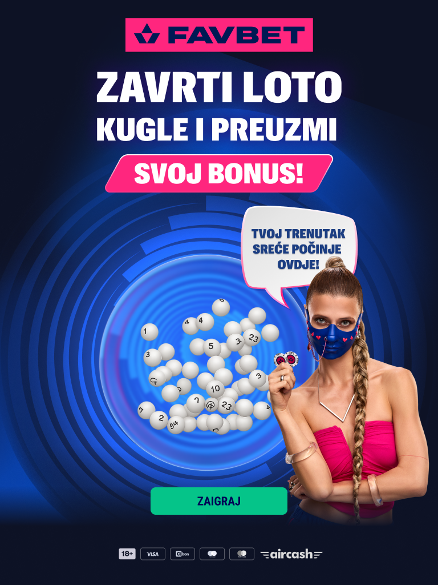

# Favbet Loto Landing Page



## Опис

Інтерактивна лендінг-сторінка з 3D анімацією лотерейних кульок, створена за допомогою Three.js.

## Особливості

- **3D сцена** — сферичний контейнер з 80 кульками
- **Фізика** — гравітація, колізії між кульками та стінками
- **Анімація вітру** — кульки "трусяться" з турбулентністю
- **WIN кулька** — велика кулька з градієнтом, що з'являється при виграші
- **Послідовність виграшу** — вітер → всмоктування куль → поява WIN кульки → попап
- **Попапи** — модальні вікна з анімацією появи

## Технології

- **Three.js** — 3D графіка
- **Gulp** — збірка проекту
- **Pug** — шаблонізатор HTML
- **Sass** — препроцесор CSS
- **Browserify + Babel** — бандлінг JS

## Встановлення

```bash
npm install
```

## Запуск

```bash
# Режим розробки
npm run dev

# Збірка для продакшену
npm run build
```

## Структура

```
├── front/
│   ├── js/main.js      # Головний JS (Three.js сцена)
│   ├── pug/            # Pug шаблони
│   ├── sass/           # Стилі
│   ├── fonts/          # Шрифти
│   └── img/            # Зображення
├── build/              # Зібраний проект
├── gulpfile.js         # Gulp конфігурація
└── package.json
```

## API

```javascript
// Контролер сцени
windController.toggleWind()        // Вмикає/вимикає вітер
windController.showWinBall()       // Показує WIN кульку
windController.resetScene()        // Скидає сцену
windController.playWinSequence()   // Запускає послідовність виграшу
```

